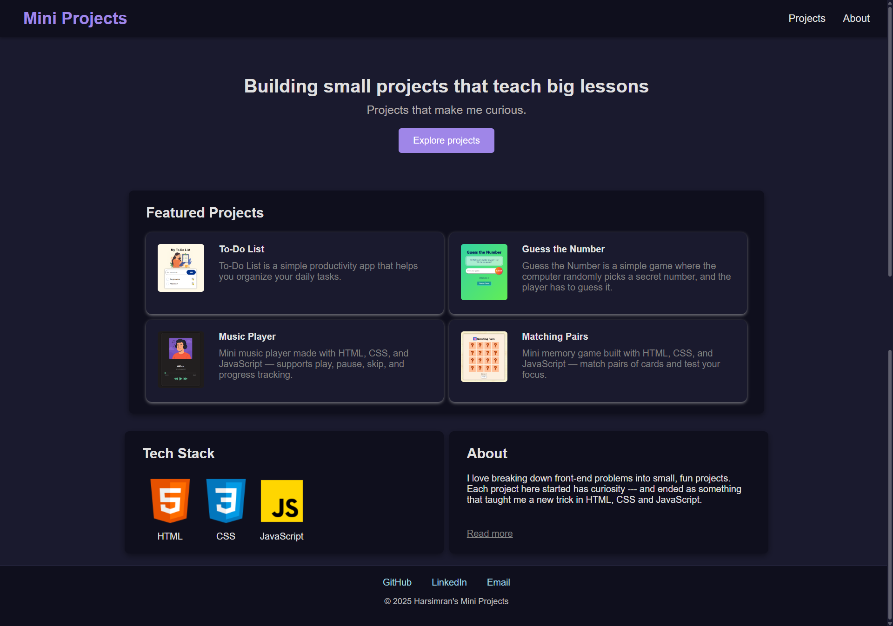
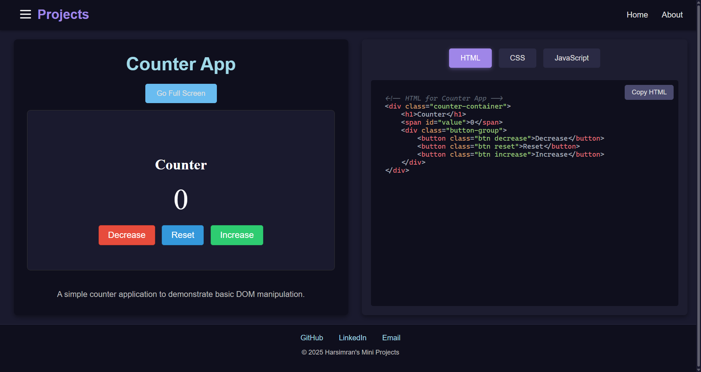

# 🚀 Mini Projects Website

  A simple and fast website where I showcase all my mini web development projects in one place.
  Each project opens directly inside the website using an iframe, so you can preview everything without leaving the page.
  You can also view the source code right beside the preview, which makes it easy to understand the logic behind each project.

## Screenshot
  
  
  

## Live Demo

  👉 [Click here to open the website](https://mini-projects-website.netlify.app/)


## 🔥 Features

### - Inline Project Preview
Every mini project loads inside an iframe — no separate tabs needed.

### - Full-Screen Mode
Expand any project for a better interactive experience.

### - Side-by-Side Source Code
HTML, CSS, and JavaScript code shown directly next to the preview.

### - Fast & Lightweight
Pure HTML, CSS, and JavaScript. No frameworks.

### - Fully Responsive
Works on desktop, tablet, and mobile.

## 🧩 Project Types
  ### 1️⃣ Embedded Mini Projects (Included Inside This Repo)

  These projects live inside the /projects folder and open through an iframe with inline source code. Examples:

  - Calculator

  - Clock

  - Color Flipper

  - Counter app

  - Form Validation

  - Guess the number

  - Joke Generator

  - JavaScript Quiz app
  
  - Matching pairs Game

  - Modal Popup
  
  - Music Player

  - Rock Paper Scissors Game

  2️⃣ External Projects (NOT Included Inside This Repo)

  These projects have their own repositories, so they are not part of this codebase.
  The website includes only their live demo links / GitHub links, not the source code.

  Examples (replace with your real list):

   1. Typing website
      - Live Demo: https://typing-website-mini-project.netlify.app/
      - GitHub Repo: https://github.com/Harsimrankaur2004/typing-website-mini-project

   2. Weather website
      - Live Demo: https://weather-website-mini-project.netlify.app/
      - GitHub Repo: https://github.com/Harsimrankaur2004/weather-mini-project
      
   3. Tea and Coffee cafe
      - Live Demo: https://tea-and-coffee-cafe.netlify.app/
      - GitHub Repo: https://github.com/Harsimrankaur2004/teaAndcoffee

   4. Todo List
      - Live Demo: https://todolist-app-mini-project.netlify.app/
      - GitHub Repo: https://github.com/Harsimrankaur2004/todo-list

  This keeps the main website lightweight while still showcasing everything I’ve built.

## 📁 Tech Stack

  1. HTML5

  2. CSS3

  3. JavaScript (Vanilla)

  No libraries, no frameworks — just raw fundamentals.

## 🛠️ How It Works

  - Click on Explore Projects button. (or just click on any featured project you like in the home page.)

  - Select any mini project from the sidebar.

  - The project loads inside an iframe.

  - The source code is shown alongside it.

  - Use fullscreen mode if needed.

## 📜 Licensing Rules

To keep things clear:

🔒 This website (UI, layout, code viewer, design) is NOT reusable.

The main website has no license → “All Rights Reserved.”

🔓 Mini project code IS reusable.

Each mini project folder contains its own LICENSE file (MIT License).
This allows anyone to reuse the code of the mini projects individually.

Examples:

    ```bash
      projects/calculator/LICENSE
      projects/clock/LICENSE
      projects/color-flipper/LICENSE


This separation ensures:

Website stays protected

Mini project code stays open

## 🛠️ Run Locally

    ```bash
      git clone https://github.com/Harsimrankaur2004/mini-projects-website.git
      cd mini-projects-website
      open index.html